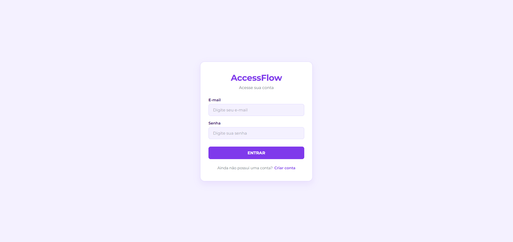
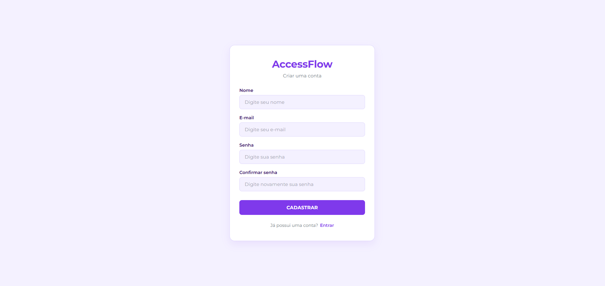

# AccessFlow

O **AccessFlow** é uma interface web moderna de login e cadastro desenvolvida como atividade de recuperação do componente **Projeto Prático Web** da Escola do Futuro de Valparaíso de Goiás.

## 🎯 Objetivo
Demonstrar o domínio nos fundamentos de desenvolvimento Front-End (HTML5 e CSS3), organização de arquivos, estilização avançada, navegação entre telas, responsividade e publicação via Git/GitHub.

## 🛠️ Tecnologias Utilizadas
- **HTML5**
- **CSS3**
- **Google Fonts** (Montserrat)
- **Git & GitHub**

## ✨ Funcionalidades
- Tela de Login (`index.html`)
- Tela de Cadastro (`register.html`)
- Navegação fluida entre páginas
- Campos estilizados com efeito de foco (`:focus`)
- Botões interativos com efeito hover (`:hover`)
- Interface responsiva para dispositivos móveis

## 📁 Estrutura de Pastas
```text
AccessFlow/
│── index.html
│── register.html
│── README.md
└── css/
    ├── style.css
    └── register.css
```
## 🖼️ Galeria do Projeto

<table>
  <tr>
    <td align="center" width="50%">
      <b>Tela de Login</b><br><br>
      
    </td>
    <td align="center" width="50%">
      <b>Tela de Cadastro</b><br><br>
      
    </td>
  </tr>
</table>

## 👨‍💻 Autor

Desenvolvido como parte de projetos práticos e acadêmicos.

* **Estudante**: Larissa Lucas Tavares
* **Instituição**: Escola do Futuro Paulo Renato de Souza
* **Curso**: Técnico em Ciencia de Dados
* **Professor**: Heraclides Mourão
